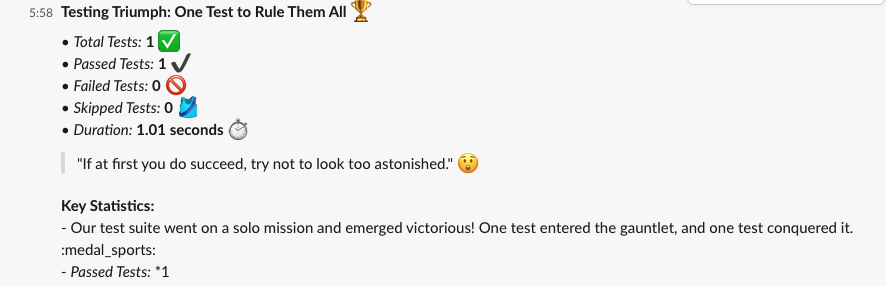

# Playwright Reporter

A custom Playwright reporter that generates humorous test report summaries and sends them to Slack and Microsoft Teams using AI-powered message generation.

## Features

- **AI-Generated Summaries**: Uses OpenAI or Anthropic's Claude to create engaging and humorous summaries of your Playwright test results.
- **Integrations**: Sends report summaries directly to Slack and Microsoft Teams via webhooks.
- **Customizable**: Choose between OpenAI and Claude models for message generation.
- **Easy Setup**: Simple configuration to get started quickly with your Playwright projects.

## Installation

Install the package via npm:

```bash
npm install @vrknetha/ai-playwright-reporter
```




## Usage

1. **Configuration**:

Add the reporter to your Playwright configuration file (e.g., `playwright.config.ts`):

```javascript
import { SlackTeamsReporterOptions } from "./src/reporter";
import { defineConfig } from "@playwright/test";
export default defineConfig({
  testDir: "playwright-tests",
  reporter: [
    ["list"],
    [
      "@vrknetha/ai-playwright-reporter",
      {
        type: "openai",
        model: "gpt-4o",
        apiKey: "your-api-key-here",
        slackWebhookUrl: "your-slack-webhook-url-here",
        teamsWebhookUrl: "your-teams-webhook-url-here",
      } as SlackTeamsReporterOptions,
    ],
  ],
});
```

2. **Environment Variables**:

Instead of hardcoding sensitive information, you can use environment variables:

- `OPENAI_API_KEY` or `ANTHROPIC_API_KEY`: Your API key for the chosen AI service
- `SLACK_WEBHOOK_URL`: Your Slack webhook URL
- `TEAMS_WEBHOOK_URL`: Your Microsoft Teams webhook URL

## Configuration Options

- `type`: The type of AI model to use for message generation.
- `model`: The model to use for message generation.
- `apiKey`: Your API key for OpenAI or Anthropic.
- `slackWebhookUrl`: The URL of your Slack webhook.
- `teamsWebhookUrl`: The URL of your Microsoft Teams webhook.

## Development

To contribute to this project:

1. Clone the repository
2. Install dependencies: `npm install`
3. Run tests: `npm test`
4. Build the package: `npm run build`

## License

This project is licensed under the MIT License.
